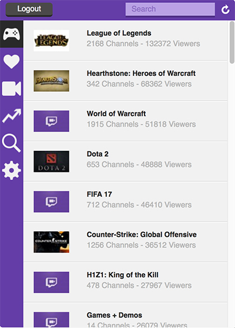

Twitch Live 
===

A useful add-on for browsing Twitch.tv games, streams and getting notifications when your followed channel come online.

You can download this add-on from directly on [Mozilla Add-ons](https://addons.mozilla.org/addon/twitch-live?src=github) page or you can install unsigned version from repository's releases directory.

**Note:** In Firefox 43 and above, unsigned add-ons are not allowed to install by default. You need to enable it from about:config (xpinstall.signatures.required). After Firefox 46, you won't be able to install unsigned add-ons. Unfortunately with no override.

## Translation Contributions

There are currently 3 translations available:

* English
* Polish
* Turkish

Special thanks to Lukasz Pawliczak for adding Polish translation! Because of English is not my native language, there may be some errors. I'm sorry about that. You can always create a pull request to fix typos. And of course new translations are welcome!

## Prerequisites

* Firefox 38 or later
* Node.js
* jpm

## Used Libraries

* Angular.js
* Angular.js Route Module
* Angular Lazy Img

## Build Instructions

1. Clone the Git repository: `git clone https://github.com/canaltinova/Twitch-Live.git`.
2. If you haven't installed node.js and jpm yet, you can download Node.js from [here](https://nodejs.org/) and then you can download jpm package with `npm install jpm -g` command. You might need sudo permission to execute that command.
3. Open your terminal in your project folder, run `jpm run`. It will create a new instance of Firefox and install the add-on.

## Screenshot

## Contributors

* Nazım Can Altınova (@canaltinova)
* Lukasz Pawliczak
* TheWyo (@TheWyo)
